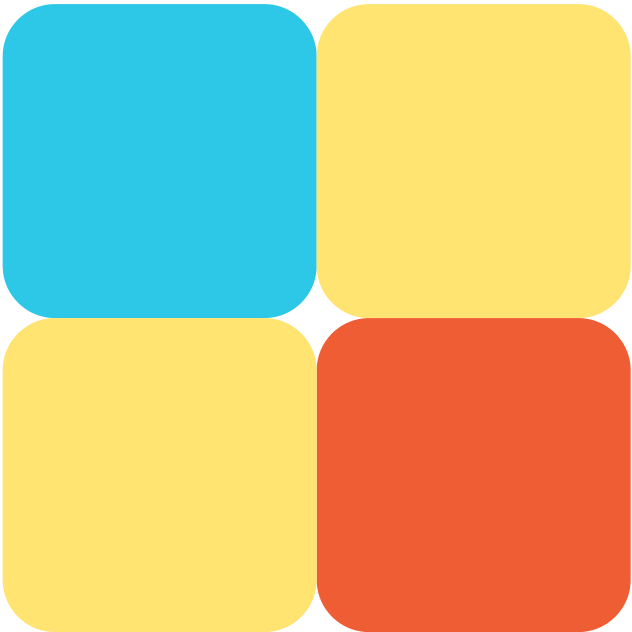

<h3 align="center">

&nbsp;<!--半角スペース1個分--> Moiku
  
    

&nbsp;<!--半角スペース1個分-->　Webサイトは
<a href="https://moiku-2022.herokuapp.com/">こちら</a>
から閲覧できます
</h3>

<!-- DOCUMENTATION -->
## 制作背景
小さい頃に虫取りを教えてくれた地域のおじさん、あやとりを教えてくれた地域のおばちゃん。
僕の周りには、興味を持ったことをすぐ教えてくれる先生達がいた。

そんな地域の先生に自分がなれているのかと、家庭教師の私は思った。
時給2400円。家庭には相当の負担になってしまう。かといって、月謝の安い集団塾では生徒の学習したい分野をそこまで重点的に教えられないだろう。

このジレンマは学問の範囲に留まない。
スポーツや芸術、料理など、興味を持った分野を気軽に学ぶことができるサービスを作りたいと思った。

